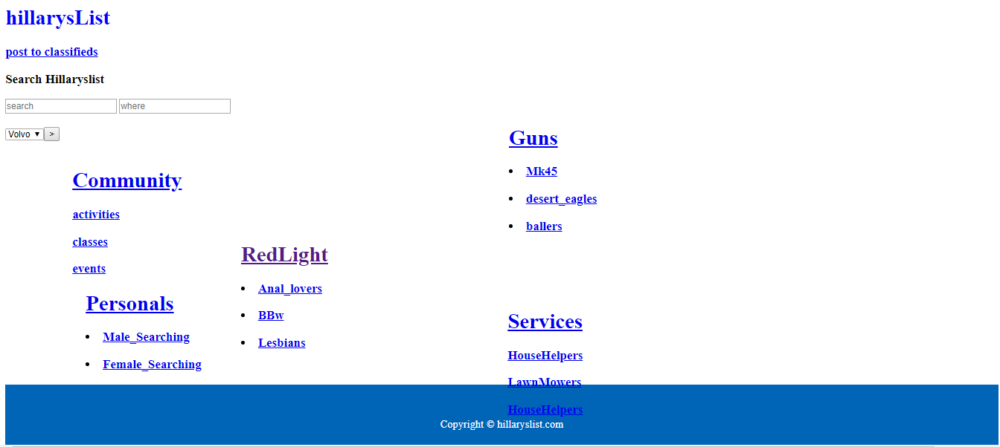
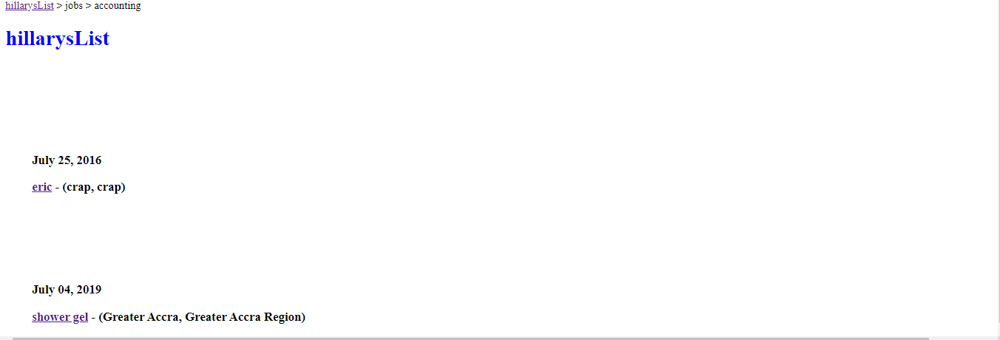
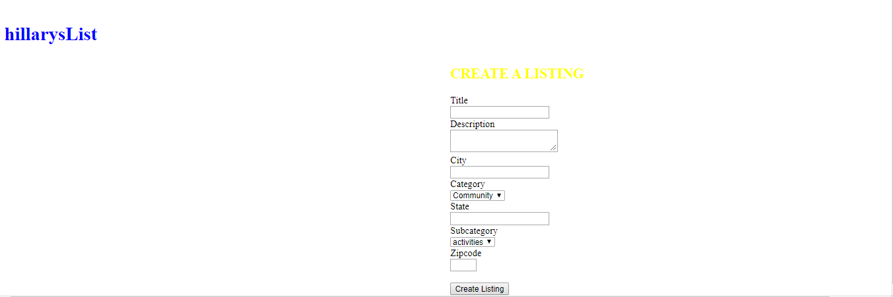

# Rails craigslist clone 

<h2 id="screenshots">Screenshots</h2>






<h2 id="development">Development</h2>


Run
```
$ run "bundle update" and the "rake db:migrate"
$ and then run  "rails s" or "rails server"

```
